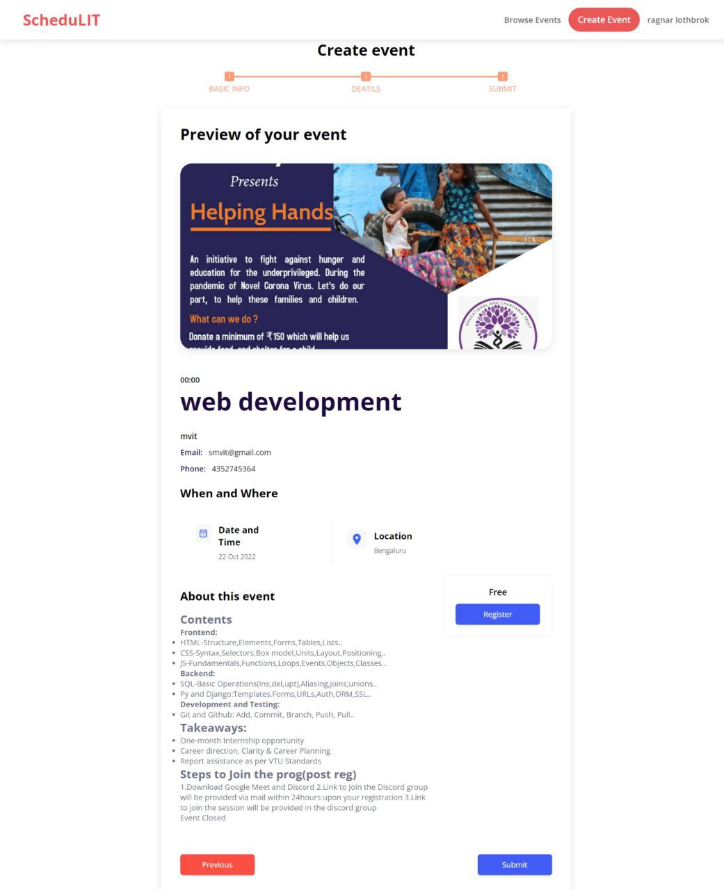
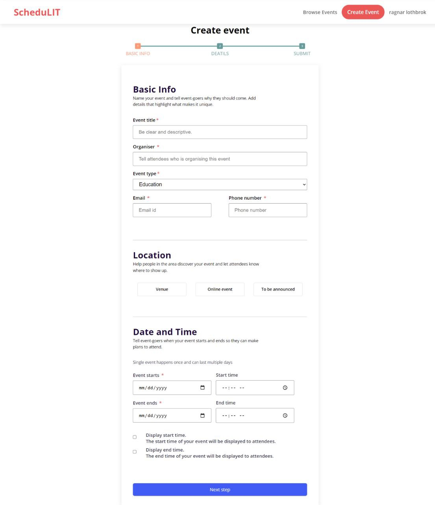

# SCHEDULIT
An Event scheduling platform for education,sports,cultural,charity,etc.

## Table of contents

- [Overview](#overview)
  - [Description](#Description)
  - [Features](#features)
  - [Links](#links)
  - [Screenshot](#screenshot)
- [Team](#team)

## Overview

### Description

- An Event scheduling platform for education,sports,cultural,charity,etc.
- It lists upcomming/ongoing events across the world or online
- user friendly UI and responsive to any device mobile,desktop,tablet etc

### Features
- Website is built using Nextjs (reactjs framework) which provides SSG (Static Site Generation) which is faster to load website, provides smooth UI user interaction, good SEO (Search Engine Optimisation), a most popular library used by developers
- User authentication is provided to create new event schedule
- Website has a user-friendly form to schedule a new event based on event type, event venue, poster etc
- Firebase (a google service) is used for data management, user authentication
- It uses firebase firestore which is real time nosql database which establishes real-time connection with client and server so no refresh of entire website to fetch new data from server
- Website has user friendly UI and it is responsive to any device screen like mobile,desktop,tablet etc
- Site is hosted in github pages using github action provided by github company
- Complete source code is in our github and it is open source

### Links
- Live site url: [https://123bharath.github.io/ScheduLIT](https://123bharath.github.io/ScheduLIT)
- Source code url: [https://github.com/123bharath/ScheduLIT](https://github.com/123bharath/ScheduLIT)

### Screenshot

## Team
- [Bharath T R](https://github.com/123bharath)
- [Bharath G T]()
- [Ravi Hegde]()
- [Vijay Naik]()
- [Vasundar Bharghav]()
 